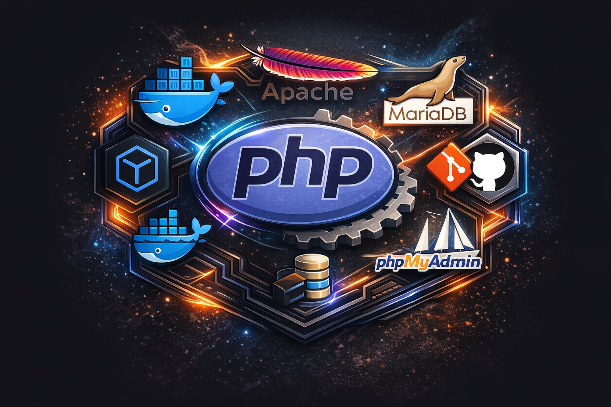

> [!WARNING]
>
> Pendiente de actualizar README con los ultimos cambios. Lista de cambios:
>
> - Se han añadido dos configuraciones de devcontainer (php y php_BD) con sus respectivos archivos (devcontainer.json, docker-compose.yml, Dockerfile y xdebug.ini).
> - La configuración php incluye un contenedor para desarrollo PHP con Xdebug.
> - La configuración php_BD añade servicios de MariaDB y phpMyAdmin a lo anterior.
> - Se ha añadido la opción de activar o desactivar phpMyAdmin a través de una variable en el archivo .env.
> - También se han actualizado las configuraciones de VSCode (launch.json) para soportar la depuración y ejecución de scripts PHP.

# PHP Debug con Xdebug en DOCKER con VSCode

Devcontainer para PHP con Xdebug en Docker con VSCode.

<html>
  <div>
  
  
  
<div/>
</html>

## Requisitos

Abrir puertos y tener en cuenta la seguridad:

-expose:

- '127.0.0.1:80:80'
- '127.0.0.1:8080:80'
- '127.0.0.1:9000:9000'
- '127.0.0.1:9003:9003'

-ports:

- '127.0.0.1:80:80'
- '127.0.0.1:8080:80'
- '127.0.0.1:9000:9000'
- '127.0.0.1:9003:9003'

### Comprobar que Xdebug está instalado, los puertos y la IP del cliente

```php
<?php
phpinfo();
?>
```



### Devcontainer.json

```json
// For format details, see https://aka.ms/devcontainer.json. For config options, see the
// README at: https://github.com/devcontainers/templates/tree/main/src/dotnet-mssql
{
  "name": "Dev php",
  "dockerComposeFile": "docker-compose.yml",
  "service": "phpdev",
  // "workspaceFolder": "/workspaces",
  //workspaceFolder es el directorio de trabajo en el contenedor
  "workspaceFolder": "/var/www/html",
  // Sincroniza el directorio del proyecto con /var/www/html
  "mounts": [
    // "source=${localWorkspaceFolder}/src,target=/var/www/html,type=bind"
    "source=${localWorkspaceFolder},target=/var/www/html,type=bind"
  ],
  "customizations": {
    "vscode": {
      "extensions": [
        "bmewburn.vscode-intelephense-client",
        "xdebug.php-debug",
        "ms-vscode-remote.remote-containers",
        "zhuangtongfa.material-theme",
        "GitHub.copilot",
        "GitHub.copilot-chat",
        "formulahendry.code-runner"
      ]
    }
  }
  // Features to add to the dev container. More info: https://containers.dev/features.
  // "features": {},
  // Configure tool-specific properties.
  // Uncomment to connect as root instead. More info: https://aka.ms/dev-containers-non-root.
  // "remoteUser": "root"
}
```

### Docker-compose.yml

```yml
version: "3.1"
services:
  phpdev:
    # extra_hosts:
    #   - "host.docker.internal:host-gateway"

    build:
      context: .
      dockerfile: Dockerfile
    hostname: phpdev

    expose:
      - "127.0.0.1:80:80"
      - "127.0.0.1:8080:80"
      # Para Xdebug
      - "127.0.0.1:9000:9000"
      - "127.0.0.1:9003:9003"

    ports:
      - "127.0.0.1:80:80"
      - "127.0.0.1:8080:80"
      # Para Xdebug
      - "127.0.0.1:9000:9000"
      - "127.0.0.1:9003:9003"

    volumes:
      - ../:/workspaces
```

### Dockerfile

```Dockerfile
FROM mcr.microsoft.com/devcontainers/php:1-8.2-bookworm

WORKDIR /var/www/html
# RUN apt-get update && \
#   apt-get install -y \
#   libpng-dev \
#   libzip-dev && \
#   pecl install xdebug-3.1.6 && \
#   apt-get clean && \
#   rm -rf /var/lib/apt/lists/* && \
#   docker-php-ext-install gd && \
#   docker-php-ext-install zip && \
#   docker-php-ext-install mysqli && \
#   docker-php-ext-enable xdebug

COPY xdebug.ini /usr/local/etc/php/conf.d/docker-php-ext-xdebug.ini
COPY xdebug.ini /usr/local/etc/php/conf.d/xdebug.ini
# COPY xdebug_test.ini /usr/local/etc/php/conf.d/xdebug_test.ini

EXPOSE 80
EXPOSE 8080
EXPOSE 9000
EXPOSE 9003
```

### Xdebug.ini

```ini
# /usr/local/etc/php/conf.d/xdebug.ini o docker-php-ext-xdebug.ini Ademas abrir puertos 9000 y 9003
# Tambien se debe configurar el archivo launch.json de vscode. Apuntar en hosts a:
# 127.0.0.1 host.docker.internal
# 127.0.0.1 gateway.docker.internal
zend_extension=xdebug.so
xdebug.mode=debug,develop
xdebug.idekey=VSCODE
xdebug.start_with_request=yes
xdebug.discover_client_host =0
xdebug.client_port=9003
; xdebug.client_host=127.0.0.1
xdebug.client_host=host.docker.internal
xdebug.log=/var/log/apache2/xdebug.log
```

### launch.json de VSCode para debug

```json
{
  // Use IntelliSense para saber los atributos posibles.
  // Mantenga el puntero para ver las descripciones de los existentes atributos.
  // Para más información, visite: https://go.microsoft.com/fwlink/?linkid=830387
  "version": "0.2.0",
  "configurations": [
    {
      "name": "Listen for Xdebug",
      "type": "php",
      "request": "launch",
      "port": 9003,
      // hostname: para indicar que se va a usar el servidor interno de PHP
      // 0.0.0.0 porque es el valor por defecto. no HACE FALTA
      "hostname": "0.0.0.0",
      "pathMappings": {
        "/var/www/html": "${workspaceRoot}"
      }
    },
    {
      "name": "Launch currently open script",
      "type": "php",
      "request": "launch",
      "program": "${file}",
      "cwd": "${fileDirname}",
      "port": 0,
      "runtimeArgs": ["-dxdebug.start_with_request=yes"],
      "env": {
        "XDEBUG_MODE": "debug,develop",
        "XDEBUG_CONFIG": "client_port=${port}"
      }
    },
    {
      "name": "Launch Built-in web server",
      "type": "php",
      "request": "launch",
      "runtimeArgs": [
        "-dxdebug.mode=debug",
        "-dxdebug.start_with_request=yes",
        // "-S", para indicar que se va a usar el servidor interno de PHP
        // "localhost:80 u 8080. El puerto que se va a usar. Uno de los que tengas abierto
        "-S",
        "localhost:80"
      ],
      "program": "",
      "cwd": "${workspaceRoot}",
      "port": 9003,
      "serverReadyAction": {
        "pattern": "Development Server \\(http://localhost:([0-9]+)\\) started",
        // ${relativeFile} para abrir el archivo actual
        "uriFormat": "http://localhost:%s/${relativeFile}",
        "action": "openExternally"
      }
    }
  ]
}
```

### Hosts

```powershell
# para registry de Docker
#44.208.254.194	registry-1.docker.io
#98.85.153.80	registry-1.docker.io
#3.94.224.37		registry-1.docker.io
# Added by Docker Desktop
#192.168.1.42 host.docker.internal
#192.168.1.42 gateway.docker.internal
#cambie de ip
#192.168.1.14 host.docker.internal
#192.168.1.14 gateway.docker.internal
127.0.0.1 host.docker.internal
127.0.0.1 gateway.docker.internal

# To allow the same kube context to work on the host and the container:
127.0.0.1 kubernetes.docker.internal
# End of section
```
