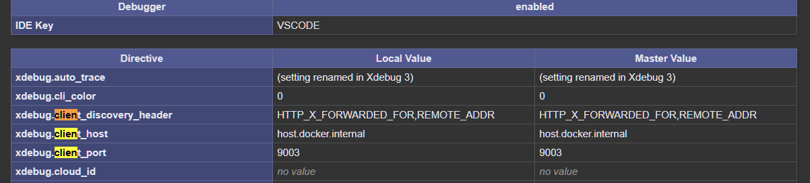

# PHP Dev Container (Docker + VS Code + Xdebug)

Dev Container para desarrollo PHP con Docker, VS Code y Xdebug, orientado a entornos
de desarrollo reproducibles, portátiles y preparados para depuración profesional.

El proyecto incluye dos configuraciones:

- Un entorno PHP con Apache y Xdebug.
- Un entorno PHP ampliado con MariaDB y phpMyAdmin.

Está pensado tanto para desarrollo local como para entornos en la nube (GitHub Codespaces).

<p align="center">
  
</p>

## Quick start

1. Abre el repo en VS Code.
2. `Reopen in Container`.
3. Inicia la configuración **Listen for Xdebug**.
4. Abre `web_test/test_debug.php` en el navegador.
5. Listo para desarrollar y depurar.

# Índice

- [Descripción](#descripción)
- [Tecnologías utilizadas](#tecnologías-utilizadas)
- [Cambios recientes](#cambios-recientes)
- [Cómo se abre paso a paso para lanzar el contenedor en VSCode](#cómo-se-abre-paso-a-paso-para-lanzar-el-contenedor-en-vscode)
- [Cómo probar localmente](#cómo-probar-localmente)
- [Imágenes utilizadas](#imágenes-utilizadas)
- [Abrir puertos y tener en cuenta la seguridad](#abrir-puertos-y-tener-en-cuenta-la-seguridad)
- [Comprobar que Xdebug está instalado, los puertos y la IP del cliente](#comprobar-que-xdebug-está-instalado-los-puertos-y-la-ip-del-cliente)
- [Devcontainer.json](#devcontainerjson)
- [Docker-compose.yml](#docker-composeyml)
- [Dockerfile](#dockerfile)
- [Xdebug.ini](#xdebugini)
- [launch.json de VSCode para debug](#launchjson-de-vscode-para-debug)
- [Hosts](#hosts)

## Descripción

Este repositorio contiene configuraciones para un entorno de desarrollo PHP utilizando Docker y VSCode, con soporte para depuración mediante Xdebug. Incluye dos configuraciones de devcontainer: una básica para PHP y otra que añade servicios de base de datos (MariaDB y phpMyAdmin).

Hago uso de devcontainers <a href="https://code.visualstudio.com/docs/remote/containers" target="_blank">devcontainers</a>. Son entornos de desarrollo definidos por
código que permiten a los desarrolladores crear y configurar entornos de desarrollo consistentes y portátiles, utilizando contenedores Docker. Los devcontainers
facilitan la configuración del entorno de desarrollo al proporcionar un archivo de configuración `devcontainer.json` que define las dependencias, herramientas y configuraciones necesarias para el proyecto.
Esto permite a los desarrolladores trabajar en un entorno aislado y reproducible, lo que mejora la colaboración y reduce los problemas relacionados con las diferentes configuraciones de los entorno de desarrollo entre diferentes máquinas e incluso en la misma máquina.

Se pueden usar devcontainers para una variedad de propósitos, como:

- Configurar entornos de desarrollo para proyectos específicos.
- Probar aplicaciones en diferentes configuraciones de entorno.
- Facilitar la colaboración entre equipos de desarrollo al garantizar que todos trabajen en el mismo entorno.
- Automatizar la configuración del entorno de desarrollo para nuevos miembros del equipo.
- Aislar dependencias y herramientas específicas del proyecto para evitar conflictos con otras aplicaciones en la máquina del desarrollador.

Pueden usar devcontainers para proyectos en una amplia gama de lenguajes de programación y marcos de trabajo, incluyendo Node.js, Python, Java, .NET, PHP, Ruby, entre otros.

También se puede usar con GitHub Codespaces, que permite crear entornos de desarrollo
en la nube basados en Dev Containers directamente desde repositorios de GitHub.

De forma adicional, Google Project IDX ofrece soporte experimental para `devcontainer.json`.
Otros IDEs como los de JetBrains pueden interactuar con el entorno mediante Docker,
aunque no ofrecen soporte nativo para Dev Containers.

En mi caso, he creado dos devcontainers para proyectos de desarrollo en PHP, uno básico y otro con base de datos.

## Tecnologías utilizadas

<p align="center">
  
</p>

- PHP 8.2
- Apache
- Docker / Docker Compose
- Dev Containers (VS Code)
- Xdebug 3
- MariaDB (opcional)
- phpMyAdmin (opcional)
- Visual Studio Code

## Cambios recientes

Para ver el detalle de los cambios, consulta el archivo [CHANGELOG.md](CHANGELOG.md).

## Cómo se abre paso a paso para lanzar el contenedor en VSCode

1. Abre **Visual Studio Code**.
2. Asegúrate de tener instalada la extensión **Dev Containers**
   (`ms-vscode-remote.remote-containers`).
3. Clona el repositorio o abre la carpeta del proyecto:

   ```bash
   git clone https://github.com/JeserM/helloDevPhp
   cd helloDevPhp
   ```

   También puedes usar Clone Repository desde la paleta de comandos (Ctrl + Shift + P → Git: Clone).

4. Una vez abierto el proyecto, VS Code detectará automáticamente la
   configuración del Dev Container.

5. Haz clic en el icono verde de la esquina inferior izquierda de VS Code y selecciona: Ejecuta `Dev Containers: Reopen in Container`.

6. Si existen varias configuraciones disponibles, selecciona la que necesites:
   - php → PHP + Apache + Xdebug
   - php_BD → PHP + Apache + Xdebug + MariaDB + phpMyAdmin

7. VS Code construirá el contenedor y abrirá el entorno de desarrollo
   dentro de Docker.
   La primera vez puede tardar unos minutos.

8. Cuando el proceso finalice, el entorno estará listo para desarrollar
   dentro del contenedor.

## Cómo probar localmente:

1.  Abre el proyecto en VS Code y asegúrate de estar trabajando dentro del Dev Container seleccionado (php o php_BD).

2.  Verifica que el contenedor ha arrancado correctamente y que el workspace está montado en:
    - `/var/www/html`

3.  Abre en el navegador del host el archivo de comprobación:

    http://localhost:80/web_test/phpinfo.php

4.  Comprueba que PHP está funcionando y que **Xdebug aparece habilitado**
    en la salida de `phpinfo()`.

5.  En VS Code, abre el panel **Run and Debug** (`Ctrl + Shift + D`).

6.  Selecciona la configuración **Listen for Xdebug** y pulsa **Start Debugging**.

7.  Coloca un breakpoint en el archivo:
    `web_test/test_debug.php`

8.  Accede al archivo desde el navegador:

    http://localhost:80/web_test/test_debug.php

9.  La ejecución se detendrá en el breakpoint, permitiendo inspeccionar
    variables y depurar el código paso a paso.

> 💡 Consejo: inicia siempre la escucha de Xdebug antes de acceder a cualquier
> script PHP para asegurar que la conexión se establece correctamente.

## Imágenes utilizadas

Las imágenes base son orientativas. Deberías elegir aquellas que mejor se adapten a tus
necesidades, que estén estables y actualizadas. Las utilizadas en este proyecto sirven
como ejemplo y funcionan correctamente.

Para el contenedor de desarrollo PHP se utiliza la siguiente imagen base, que incluye
Apache y PHP 8.2 sobre Debian Bookworm. Es una imagen oficial de Microsoft para Dev Containers:

- mcr.microsoft.com/devcontainers/php:1-8.2-bookworm

Para la base de datos he utilizado MariaDB por facilidad de uso y configuración:

- mariadb:11.8-ubi9-rc

Para añadir un servicio más y mostrar que pueden escalarse los devcontainers, he añadido phpMyAdmin para gestionar la base de datos desde un navegador web:

- phpmyadmin:5.2.2-apache

# Estado del proyecto y notas adicionales

La documentación se irá ampliando a medida que se incorporen nuevas funcionalidades
y se prueben distintos escenarios.

El repositorio incluye ejemplos, pruebas y pequeños parches que fueron surgiendo
durante la creación del dev container, así como recomendaciones de seguridad y
consideraciones adicionales (por ejemplo, el archivo `hosts`).

## Abrir puertos y tener en cuenta la seguridad:

Para evitar exponer servicios a toda la red, se recomienda bindear a localhost:

**ports (acceso desde el host):**

- `127.0.0.1:80:80`
- `127.0.0.1:8080:80`
- `127.0.0.1:9000:9000` (Xdebug antiguos)
- `127.0.0.1:9003:9003` (Xdebug 3)

**expose (acceso entre contenedores):**

- `80`
- `9000`
- `9003`

### Comprobar que Xdebug está instalado, los puertos y la IP del cliente

Abre el archivo `phpinfo.php` en el navegador para comprobar que Xdebug está instalado. Comprueba también que el puerto y el valor de `client_host` coinciden con los definidos en el archivo `xdebug.ini`. Esto te ayudará a evitar tener que cambiar la IP del cliente cada vez que cambies de red. Revisa bien estos datos y asegúrate de que la configuración de `xdebug.ini`, `launch.json` y el archivo `hosts` sea coherente.

```php
<?php
phpinfo();
?>
```



### Devcontainer.json

```json
// For format details, see https://aka.ms/devcontainer.json. For config options, see the
// README at: https://github.com/devcontainers/templates/tree/main/src/dotnet-mssql
{
  "name": "Dev php",
  "dockerComposeFile": "docker-compose.yml",
  "service": "phpdev",
  // "workspaceFolder": "/workspaces",
  //workspaceFolder es el directorio de trabajo en el contenedor
  "workspaceFolder": "/var/www/html",
  // Sincroniza el directorio del proyecto con /var/www/html
  "mounts": [
    // "source=${localWorkspaceFolder}/src,target=/var/www/html,type=bind"
    "source=${localWorkspaceFolder},target=/var/www/html,type=bind"
  ],
  "customizations": {
    "vscode": {
      "extensions": [
        "bmewburn.vscode-intelephense-client",
        "xdebug.php-debug",
        "ms-vscode-remote.remote-containers",
        "zhuangtongfa.material-theme",
        "GitHub.copilot",
        "GitHub.copilot-chat",
        "formulahendry.code-runner"
      ]
    }
  }
  // Features to add to the dev container. More info: https://containers.dev/features.
  // "features": {},
  // Configure tool-specific properties.
  // Uncomment to connect as root instead. More info: https://aka.ms/dev-containers-non-root.
  // "remoteUser": "root"
}
```

### Docker-compose.yml

```yml
version: "3.1"
services:
  phpdev:
    # extra_hosts:
    #   - "host.docker.internal:host-gateway"

    build:
      context: .
      dockerfile: Dockerfile
    hostname: phpdev

    expose:
      - "80"
      # Para Xdebug
      - "9000"
      - "9003"

    ports:
      - "127.0.0.1:80:80"
      - "127.0.0.1:8080:80"
      # Para Xdebug
      - "127.0.0.1:9000:9000"
      - "127.0.0.1:9003:9003"

    volumes:
      - ../:/workspaces
```

### Dockerfile

```Dockerfile
FROM mcr.microsoft.com/devcontainers/php:1-8.2-bookworm

WORKDIR /var/www/html
# RUN apt-get update && \
#   apt-get install -y \
#   libpng-dev \
#   libzip-dev && \
#   pecl install xdebug-3.1.6 && \
#   apt-get clean && \
#   rm -rf /var/lib/apt/lists/* && \
#   docker-php-ext-install gd && \
#   docker-php-ext-install zip && \
#   docker-php-ext-install mysqli && \
#   docker-php-ext-enable xdebug

COPY xdebug.ini /usr/local/etc/php/conf.d/docker-php-ext-xdebug.ini
COPY xdebug.ini /usr/local/etc/php/conf.d/xdebug.ini
# COPY xdebug_test.ini /usr/local/etc/php/conf.d/xdebug_test.ini

EXPOSE 80
EXPOSE 8080
EXPOSE 9000
EXPOSE 9003
```

### Xdebug.ini

```ini
# /usr/local/etc/php/conf.d/xdebug.ini o docker-php-ext-xdebug.ini Ademas abrir puertos 9000 y 9003
# Tambien se debe configurar el archivo launch.json de vscode. Apuntar en hosts a:
# 127.0.0.1 host.docker.internal
# 127.0.0.1 gateway.docker.internal
zend_extension=xdebug.so
xdebug.mode=debug,develop
xdebug.idekey=VSCODE
xdebug.start_with_request=yes
xdebug.discover_client_host =0
xdebug.client_port=9003
; xdebug.client_host=127.0.0.1
xdebug.client_host=host.docker.internal
xdebug.log=/var/log/apache2/xdebug.log
```

### launch.json de VSCode para debug

> [!WARNING]
> Este archivo debe estar en la carpeta .vscode del proyecto. es con el que se configura VSCode para depurar con Xdebug.
> He tenido que hacer algunos ajustes para que funcione correctamente con el contenedor y Xdebug 3. POr ejemplo, he cambiado el puerto a 9003 que es el que usa Xdebug 3 por defecto. Así como que lance como localhost y no la IP del contenedor.
> Pueden hacerse mejores ajustes según las necesidades de cada uno. Para mi caso de uso funciona correctamente y no necesitaba mas. Es solo una idea de como configurarlo.

```json
{
  // Use IntelliSense para saber los atributos posibles.
  // Mantenga el puntero para ver las descripciones de los existentes atributos.
  // Para más información, visite: https://go.microsoft.com/fwlink/?linkid=830387
  "version": "0.2.0",
  "configurations": [
    {
      "name": "Listen for Xdebug",
      "type": "php",
      "request": "launch",
      "port": 9003,
      // hostname: para indicar que se va a usar el servidor interno de PHP
      // 0.0.0.0 porque es el valor por defecto. no HACE FALTA
      "hostname": "0.0.0.0",
      "pathMappings": {
        "/var/www/html": "${workspaceRoot}"
      }
    },
    {
      "name": "Launch currently open script",
      "type": "php",
      "request": "launch",
      "program": "${file}",
      "cwd": "${fileDirname}",
      "port": 0,
      "runtimeArgs": ["-dxdebug.start_with_request=yes"],
      "env": {
        "XDEBUG_MODE": "debug,develop",
        "XDEBUG_CONFIG": "client_port=${port}"
      }
    },
    {
      "name": "Launch Built-in web server",
      "type": "php",
      "request": "launch",
      "runtimeArgs": [
        "-dxdebug.mode=debug",
        "-dxdebug.start_with_request=yes",
        // "-S", para indicar que se va a usar el servidor interno de PHP
        // "localhost:80 u 8080. El puerto que se va a usar. Uno de los que tengas abierto
        "-S",
        "localhost:80"
      ],
      "program": "",
      "cwd": "${workspaceRoot}",
      "port": 9003,
      "serverReadyAction": {
        "pattern": "Development Server \\(http://localhost:([0-9]+)\\) started",
        // ${relativeFile} para abrir el archivo actual
        "uriFormat": "http://localhost:%s/${relativeFile}",
        "action": "openExternally"
      }
    }
  ]
}
```

### Hosts

```powershell
# para registry de Docker
#44.208.254.194	registry-1.docker.io
#98.85.153.80	registry-1.docker.io
#3.94.224.37		registry-1.docker.io
# Added by Docker Desktop
#192.168.1.42 host.docker.internal
#192.168.1.42 gateway.docker.internal
#cambie de ip
#192.168.1.14 host.docker.internal
#192.168.1.14 gateway.docker.internal
127.0.0.1 host.docker.internal
127.0.0.1 gateway.docker.internal

# To allow the same kube context to work on the host and the container:
127.0.0.1 kubernetes.docker.internal
# End of section
```
