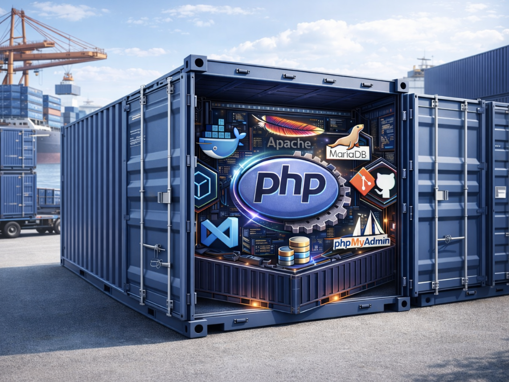
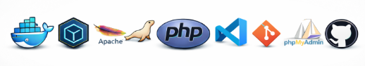

# PHP Debug con Xdebug en DOCKER con VSCode

Devcontainer para PHP con Xdebug en Docker con VSCode.

<html>
  <div style="text-align: center;">
    
    <!--  -->
  </div>
</html>

# Índice

- [Descripción](#descripción)
- [Cambios recientes](#cambios-recientes)
- [Cómo se abre paso a paso para lanzar el contenedor en VSCode](#cómo-se-abre-paso-a-paso-para-lanzar-el-contenedor-en-vscode)
- [Cómo probar localmente](#cómo-probar-localmente)
- [Imagenes utilizadas](#imagenes-utilizadas)
- [Abrir puertos y tener en cuenta la seguridad](#abrir-puertos-y-tener-en-cuenta-la-seguridad)
- [Comprobar que Xdebug está instalado, los puertos y la IP del cliente](#comprobar-que-xdebug-está-instalado-los-puertos-y-la-ip-del-cliente)
- [Devcontainer.json](#devcontainerjson)
- [Docker-compose.yml](#docker-composeyml)
- [Dockerfile](#dockerfile)
- [Xdebug.ini](#xdebugini)
- [launch.json de VSCode para debug](#launchjson-de-vscode-para-debug)
- [Hosts](#hosts)

## Descripción

Este repositorio contiene configuraciones para un entorno de desarrollo PHP utilizando Docker y VSCode, con soporte para depuración mediante Xdebug. Incluye dos configuraciones de devcontainer: una básica para PHP y otra que añade servicios de base de datos (MariaDB y phpMyAdmin).

<html>
  <div style="text-align: centerleft;">
    
  </div>
</html>

Que es devcontainer: https://code.visualstudio.com/docs/remote/containers

Son entornos de desarrollo definidos por código que permiten a los desarrolladores crear y configurar entornos de desarrollo consistentes y portátiles utilizando contenedores Docker. Los devcontainers facilitan la configuración del entorno de desarrollo al proporcionar un archivo de configuración (devcontainer.json) que define las dependencias, herramientas y configuraciones necesarias para el proyecto.
Esto permite a los desarrolladores trabajar en un entorno aislado y reproducible, lo que mejora la colaboración y reduce los problemas relacionados con las diferencias en las configuraciones del entorno de desarrollo entre diferentes máquinas.

Se pueden usar devcontainers para una variedad de propósitos, como:

- Configurar entornos de desarrollo para proyectos específicos.
- Probar aplicaciones en diferentes configuraciones de entorno.
- Facilitar la colaboración entre equipos de desarrollo al garantizar que todos trabajen en el mismo entorno.
- Automatizar la configuración del entorno de desarrollo para nuevos miembros del equipo.
- Aislar dependencias y herramientas específicas del proyecto para evitar conflictos con otras aplicaciones en la máquina del desarrollador.

Pueden usar devcontainers para proyectos en una amplia gama de lenguajes de programación y marcos de trabajo, incluyendo Node.js, Python, Java, .NET, PHP, Ruby, entre otros.

Tambien se puede usar con GitHub Codespaces, que permite a los desarrolladores crear entornos de desarrollo en la nube basados en devcontainers directamente desde repositorios de GitHub.Asi como con otros ides como JetBrains, antigr

En mi caso, he creado dos devcontainers para proyectos PHP, uno básico y otro con base de datos.

## Cambios recientes

> [!WARNING]
>
> Pendiente de actualizar README con los ultimos cambios. Lista de cambios:
>
> - Se han añadido dos configuraciones de devcontainer (php y php_BD) con sus respectivos archivos (devcontainer.json, docker-compose.yml, Dockerfile y xdebug.ini).
> - La configuración php incluye un contenedor para desarrollo PHP con Xdebug.
> - La configuración php_BD añade servicios de MariaDB y phpMyAdmin a lo anterior.
> - Se ha añadido la opción de activar o desactivar phpMyAdmin a través de una variable en el archivo .env.
> - También se han actualizado las configuraciones de VSCode (launch.json) para soportar la depuración y ejecución de scripts PHP.
> - Cambios en los archivos Dockerfile y xdebug.ini para mejorar la configuración de Xdebug y la instalación de extensiones PHP.
>
> Cambios principales (resumen):
>
> - Añadida segunda configuración de devcontainer (php_BD) que incluye MariaDB y phpMyAdmin; phpMyAdmin puede activarse vía .env en [.devcontainer/php_BD/.env](.devcontainer/php_BD/.env) (si existe).
> - Ajustes en Xdebug: modo debug/ develop, idekey por defecto VSCODE, start_with_request=yes, client_port=9003 y client_host apuntando a host.docker.internal para compatibilidad con contenedores.
> - Dockerfiles actualizados para instalar extensiones necesarias (por ejemplo pdo_mysql) y copiar xdebug.ini en /usr/local/etc/php/conf.d/.
> - Actualizadas configuraciones de VSCode en [.vscode/launch.json](.vscode/launch.json) para:
>   - Escuchar Xdebug en el puerto 9003.
>   - Lanzar scripts abiertos con Xdebug habilitado.
>   - Ejecutar servidor integrado con acciones para abrir el navegador cuando el servidor esté listo.
> - Documentación añadida en README.md para explicar la configuración, pruebas y recomendaciones de seguridad.
>
> Archivos clave modificados:
>
> - [.devcontainer/php/devcontainer.json](.devcontainer/php/devcontainer.json)
> - [.devcontainer/php/docker-compose.yml](.devcontainer/php/docker-compose.yml)
> - [.devcontainer/php/Dockerfile](.devcontainer/php/Dockerfile)
> - [.devcontainer/php/xdebug.ini](.devcontainer/php/xdebug.ini)
> - [.devcontainer/php_BD/devcontainer.json](.devcontainer/php_BD/devcontainer.json)
> - [.devcontainer/php_BD/docker-compose.yml](.devcontainer/php_BD/docker-compose.yml)
> - [.devcontainer/php_BD/Dockerfile](.devcontainer/php_BD/Dockerfile)
> - [.devcontainer/php_BD/xdebug.ini](.devcontainer/php_BD/xdebug.ini)
> - [.vscode/launch.json](.vscode/launch.json)
>
> Comprobaciones y recomendaciones de seguridad y puertos:
>
> - Se recomiendan bindings locales (127.0.0.1) para los puertos expuestos: 80, 8080, 9000, 9003.
> - Comprobar que Xdebug está instalado y configurado correctamente mediante un script phpinfo().
> - Compruebor el archivo hosts para mapear host.docker.internal a 127.0.0.1 si usa Docker Desktop o entornos donde host-gateway no esté disponible.
> - Se recomienda usar host.docker.internal en xdebug.client_host para evitar tener que modificar constantemente la IP cliente en múltiples redes.
>
> Detalles técnicos añadidos:
>
> - Se documentó explícitamente que los ficheros xdebug.ini se copian en dos nombres para asegurar carga en distintos entornos: docker-php-ext-xdebug.ini y xdebug.ini. Ver [.devcontainer/php/Dockerfile](.devcontainer/php/Dockerfile).
> - Se recomienda usar host.docker.internal en xdebug.client_host para evitar tener que modificar constantemente la IP cliente en múltiples redes.

## Cómo se abre paso a paso para lanzar el contenedor en VSCode:

1. Abre VSCode.
2. Instala la extensión "Remote - Containers" si no la tienes ya.
3. Clona este repositorio o abre la carpeta del proyecto que contiene el devcontainer. Para clonar el repositorio, usa el comando:

   ```bash
   git clone
   o puedes desde VSCode usar "Clone Repository" desde la paleta de comandos (Ctrl+Shift+P).
   ```

4. Una vez clonado. Hay dos configuraciones de devcontainer disponibles en la carpeta .devcontainer:
   - php: Contenedor básico para desarrollo PHP con Xdebug.
   - php_BD: Contenedor para desarrollo PHP con Xdebug, MariaDB y phpMyAdmin.
5. Haz clic en el icono verde en la esquina inferior izquierda de VSCode (Remote - Containers).
6. Selecciona "Reopen in Container".
7. VSCode construirá y abrirá el contenedor según la configuración del devcontainer.json seleccionado. Esto puede tardar unos minutos la primera vez.
8. Una vez dentro del contenedor, puedes abrir una terminal integrada (Ctrl+`) para ejecutar comandos dentro del contenedor.
9. Abre los archivos PHP en el contenedor y comienza a desarrollar.

## Cómo probar localmente:

1.  Abrir el proyecto en VSCode y usar "Reopen in Container" con la configuración deseada (php o php_BD).
2.  Verificar que el contenedor arranque sin errores y que las rutas de workspace estén mapeadas a /var/www/html.
3.  Abrir [web_test/phpinfo.php](web_test/phpinfo.php) en el navegador del host (ej. http://localhost:80 o el puerto configurado) para confirmar phpinfo y Xdebug.
4.  Iniciar la configuración "Listen for Xdebug" desde la paleta de depuración de VSCode (configuración en [.vscode/launch.json](.vscode/launch.json)).
5.  Colocar un punto de interrupción en [web_test/test_debug.php](web_test/test_debug.php) y acceder a este archivo desde el navegador (ej. http://localhost:80/web_test/test_debug.php) o iniciar directmente la depuración con la configuración "Launch Built-in web server" desde VSCode.
6.  Verificar que la ejecución se detiene en el punto de interrupción y que se pueden inspeccionar variables y avanzar en la depuración.

## Imagenes utilizadas

Las imagenes base son a modo orientativo. Deberias elegir las que mejor se adapten a tus necesidades, estables y actualizadas. Las que he usado deberían ser modificadas, pero para el caso de ejemplo sirven y estna funcionando correctamente.
Para el caso del contendor de desarrollo de PHP he utilizado la siguiente imagen base, que incluye Apache y PHP 8.2 sobre Debian Bookworm, es una imagen oficial de Microsoft para devcontainers:

- mcr.microsoft.com/devcontainers/php:1-8.2-bookworm

Para la base de datos he utilizado mariaDB por facilidad de uso y configuración:

- Mariadb:11.8-ubi9-rc

Para añadir un servicio mas y mostrar que pueden escalarse los devcontainers, he añadido phpMyAdmin para gestionar la base de datos desde un navegador web:

- phpmyadmin:5.2.2-apache

# Pendiente de completar README con los apartados siguientes:

Son pequeñas muestras del contenido de los archivos mas importantes. El contenido completo está en el repositorio.
Así como instrucciones para probar y recomendaciones de seguridad, y otras consideraciones como por ejemplo el archivo hosts.

## Abrir puertos y tener en cuenta la seguridad:

-expose:

- '127.0.0.1:80:80'
- '127.0.0.1:8080:80'
- '127.0.0.1:9000:9000'
- '127.0.0.1:9003:9003'

-ports:

- '127.0.0.1:80:80'
- '127.0.0.1:8080:80'
- '127.0.0.1:9000:9000'
- '127.0.0.1:9003:9003'

### Comprobar que Xdebug está instalado, los puertos y la IP del cliente

```php
<?php
phpinfo();
?>
```


### Devcontainer.json

```json
// For format details, see https://aka.ms/devcontainer.json. For config options, see the
// README at: https://github.com/devcontainers/templates/tree/main/src/dotnet-mssql
{
  "name": "Dev php",
  "dockerComposeFile": "docker-compose.yml",
  "service": "phpdev",
  // "workspaceFolder": "/workspaces",
  //workspaceFolder es el directorio de trabajo en el contenedor
  "workspaceFolder": "/var/www/html",
  // Sincroniza el directorio del proyecto con /var/www/html
  "mounts": [
    // "source=${localWorkspaceFolder}/src,target=/var/www/html,type=bind"
    "source=${localWorkspaceFolder},target=/var/www/html,type=bind"
  ],
  "customizations": {
    "vscode": {
      "extensions": [
        "bmewburn.vscode-intelephense-client",
        "xdebug.php-debug",
        "ms-vscode-remote.remote-containers",
        "zhuangtongfa.material-theme",
        "GitHub.copilot",
        "GitHub.copilot-chat",
        "formulahendry.code-runner"
      ]
    }
  }
  // Features to add to the dev container. More info: https://containers.dev/features.
  // "features": {},
  // Configure tool-specific properties.
  // Uncomment to connect as root instead. More info: https://aka.ms/dev-containers-non-root.
  // "remoteUser": "root"
}
```

### Docker-compose.yml

```yml
version: "3.1"
services:
  phpdev:
    # extra_hosts:
    #   - "host.docker.internal:host-gateway"

    build:
      context: .
      dockerfile: Dockerfile
    hostname: phpdev

    expose:
      - "127.0.0.1:80:80"
      - "127.0.0.1:8080:80"
      # Para Xdebug
      - "127.0.0.1:9000:9000"
      - "127.0.0.1:9003:9003"

    ports:
      - "127.0.0.1:80:80"
      - "127.0.0.1:8080:80"
      # Para Xdebug
      - "127.0.0.1:9000:9000"
      - "127.0.0.1:9003:9003"

    volumes:
      - ../:/workspaces
```

### Dockerfile

```Dockerfile
FROM mcr.microsoft.com/devcontainers/php:1-8.2-bookworm

WORKDIR /var/www/html
# RUN apt-get update && \
#   apt-get install -y \
#   libpng-dev \
#   libzip-dev && \
#   pecl install xdebug-3.1.6 && \
#   apt-get clean && \
#   rm -rf /var/lib/apt/lists/* && \
#   docker-php-ext-install gd && \
#   docker-php-ext-install zip && \
#   docker-php-ext-install mysqli && \
#   docker-php-ext-enable xdebug

COPY xdebug.ini /usr/local/etc/php/conf.d/docker-php-ext-xdebug.ini
COPY xdebug.ini /usr/local/etc/php/conf.d/xdebug.ini
# COPY xdebug_test.ini /usr/local/etc/php/conf.d/xdebug_test.ini

EXPOSE 80
EXPOSE 8080
EXPOSE 9000
EXPOSE 9003
```

### Xdebug.ini

```ini
# /usr/local/etc/php/conf.d/xdebug.ini o docker-php-ext-xdebug.ini Ademas abrir puertos 9000 y 9003
# Tambien se debe configurar el archivo launch.json de vscode. Apuntar en hosts a:
# 127.0.0.1 host.docker.internal
# 127.0.0.1 gateway.docker.internal
zend_extension=xdebug.so
xdebug.mode=debug,develop
xdebug.idekey=VSCODE
xdebug.start_with_request=yes
xdebug.discover_client_host =0
xdebug.client_port=9003
; xdebug.client_host=127.0.0.1
xdebug.client_host=host.docker.internal
xdebug.log=/var/log/apache2/xdebug.log
```

### launch.json de VSCode para debug

```json
{
  // Use IntelliSense para saber los atributos posibles.
  // Mantenga el puntero para ver las descripciones de los existentes atributos.
  // Para más información, visite: https://go.microsoft.com/fwlink/?linkid=830387
  "version": "0.2.0",
  "configurations": [
    {
      "name": "Listen for Xdebug",
      "type": "php",
      "request": "launch",
      "port": 9003,
      // hostname: para indicar que se va a usar el servidor interno de PHP
      // 0.0.0.0 porque es el valor por defecto. no HACE FALTA
      "hostname": "0.0.0.0",
      "pathMappings": {
        "/var/www/html": "${workspaceRoot}"
      }
    },
    {
      "name": "Launch currently open script",
      "type": "php",
      "request": "launch",
      "program": "${file}",
      "cwd": "${fileDirname}",
      "port": 0,
      "runtimeArgs": ["-dxdebug.start_with_request=yes"],
      "env": {
        "XDEBUG_MODE": "debug,develop",
        "XDEBUG_CONFIG": "client_port=${port}"
      }
    },
    {
      "name": "Launch Built-in web server",
      "type": "php",
      "request": "launch",
      "runtimeArgs": [
        "-dxdebug.mode=debug",
        "-dxdebug.start_with_request=yes",
        // "-S", para indicar que se va a usar el servidor interno de PHP
        // "localhost:80 u 8080. El puerto que se va a usar. Uno de los que tengas abierto
        "-S",
        "localhost:80"
      ],
      "program": "",
      "cwd": "${workspaceRoot}",
      "port": 9003,
      "serverReadyAction": {
        "pattern": "Development Server \\(http://localhost:([0-9]+)\\) started",
        // ${relativeFile} para abrir el archivo actual
        "uriFormat": "http://localhost:%s/${relativeFile}",
        "action": "openExternally"
      }
    }
  ]
}
```

### Hosts

```powershell
# para registry de Docker
#44.208.254.194	registry-1.docker.io
#98.85.153.80	registry-1.docker.io
#3.94.224.37		registry-1.docker.io
# Added by Docker Desktop
#192.168.1.42 host.docker.internal
#192.168.1.42 gateway.docker.internal
#cambie de ip
#192.168.1.14 host.docker.internal
#192.168.1.14 gateway.docker.internal
127.0.0.1 host.docker.internal
127.0.0.1 gateway.docker.internal

# To allow the same kube context to work on the host and the container:
127.0.0.1 kubernetes.docker.internal
# End of section
```
