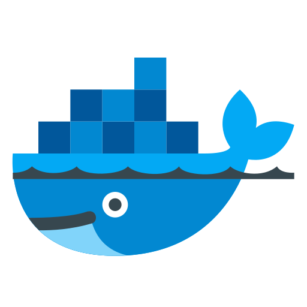

> [!WARNING]
> 
> PENDIENTE DE TERMINAR DE DOCUMENTAR BIEN, para explicar como instalar Docker, VSCode, extensiones de VSCode, etc.
> EL mapeo de los puertos en el archivo docker-compose.yml y en el archivo devcontainer.json
> Seguridad y todo eso


# PHP Debug con Xdebug en DOCKER con VSCode

Devcontainer para PHP con Xdebug en Docker con VSCode.
<html>
  <div>
  
  
  
<div/>
</html>


## Requisitos

Abrir puertos y tener en cuenta la seguridad:

-expose:

- '127.0.0.1:80:80'
- '127.0.0.1:8080:80'
- '127.0.0.1:9000:9000'
- '127.0.0.1:9003:9003'

-ports:

- '127.0.0.1:80:80'
- '127.0.0.1:8080:80'
- '127.0.0.1:9000:9000'
- '127.0.0.1:9003:9003'

### Devcontainer.json

```json
// For format details, see https://aka.ms/devcontainer.json. For config options, see the
// README at: https://github.com/devcontainers/templates/tree/main/src/dotnet-mssql
{
  "name": "Dev phpimw",
  "dockerComposeFile": "docker-compose.yml",
  "service": "phpimw",
  // "workspaceFolder": "/workspaces",
  //workspaceFolder es el directorio de trabajo en el contenedor
  "workspaceFolder": "/var/www/html",
  // Sincroniza el directorio del proyecto con /var/www/html
  "mounts": [
    // "source=${localWorkspaceFolder}/src,target=/var/www/html,type=bind"
    "source=${localWorkspaceFolder},target=/var/www/html,type=bind"
  ],
  "customizations": {
    "vscode": {
      "extensions": [
        "bmewburn.vscode-intelephense-client",
        "xdebug.php-debug",
        "ms-vscode-remote.remote-containers",
        "zhuangtongfa.material-theme",
        "GitHub.copilot",
        "GitHub.copilot-chat",
        "formulahendry.code-runner"
      ]
    }
  }
}
```

### Docker-compose.yml

```yml
version: "3.1"
services:
  phpimw:
    # extra_hosts:
    #   - "host.docker.internal:host-gateway"

    build:
      context: .
      dockerfile: Dockerfile
    hostname: phpimw

    expose:
      - "127.0.0.1:80:80"
      - "127.0.0.1:8080:80"
      - "127.0.0.1:9000:9000"
      - "127.0.0.1:9003:9003"

    ports:
      - "127.0.0.1:80:80"
      - "127.0.0.1:8080:80"
      - "127.0.0.1:9000:9000"
      - "127.0.0.1:9003:9003"

    volumes:
      - ../..:/workspaces
```

### Dockerfile

```Dockerfile
FROM mcr.microsoft.com/devcontainers/php:1-8.2-bookworm

WORKDIR /var/www/html
# RUN apt-get update && \
#   apt-get install -y \
#   libpng-dev \
#   libzip-dev && \
#   pecl install xdebug-3.1.6 && \
#   apt-get clean && \
#   rm -rf /var/lib/apt/lists/* && \
#   docker-php-ext-install gd && \
#   docker-php-ext-install zip && \
#   docker-php-ext-install mysqli && \
#   docker-php-ext-enable xdebug

COPY xdebug.ini /usr/local/etc/php/conf.d/docker-php-ext-xdebug.ini
# COPY xdebug.ini /usr/local/etc/php/conf.d/xdebug.ini
# COPY xdebug_test.ini /usr/local/etc/php/conf.d/xdebug_test.ini

EXPOSE 80
EXPOSE 8080
EXPOSE 9000
EXPOSE 9003
```

### Xdebug.ini

```ini
# /usr/local/etc/php/conf.d/xdebug.ini o docker-php-ext-xdebug.ini
zend_extension=xdebug.so
xdebug.mode=debug
xdebug.idekey=VSCODE
xdebug.start_with_request=yes
xdebug.discover_client_host =0
xdebug.client_port=9003
xdebug.client_host=127.0.0.1
; xdebug.client_host=host.docker.internal
xdebug.log=/var/log/apache2/xdebug.log
```

### launch.json de VSCode para debug

```json
{
  // Use IntelliSense para saber los atributos posibles.
  // Mantenga el puntero para ver las descripciones de los existentes atributos.
  // Para más información, visite: https://go.microsoft.com/fwlink/?linkid=830387
  "version": "0.2.0",
  "configurations": [
    {
      "name": "Listen for Xdebug",
      "type": "php",
      "request": "launch",
      "port": 9000,
      "pathMappings": {
        "/var/www/html": "${workspaceFolder}"
      }
    },
    {
      "name": "Launch currently open script",
      "type": "php",
      "request": "launch",
      "program": "${file}",
      "cwd": "${fileDirname}",
      "port": 9003,
      "runtimeArgs": ["-dxdebug.start_with_request=yes"],
      "env": {
        "XDEBUG_MODE": "debug,develop",
        "XDEBUG_CONFIG": "client_port=${port}"
      }
    },
    {
      "name": "Launch Built-in web server",
      "type": "php",
      "request": "launch",
      "runtimeArgs": [
        "-dxdebug.mode=debug",
        "-dxdebug.start_with_request=yes",
        "-S",
        "127.0.0.1:0"
      ],
      "program": "",
      "cwd": "${workspaceRoot}",
      "port": 9000,
      "pathMappings": {
        "/var/www/html": "${workspaceFolder}"
      },
      "serverReadyAction": {
        "pattern": "Development Server \\(http://127.0.0.1:([0-9]+)\\) started",
        "uriFormat": "http://127.0.0.1:%s",
        "action": "openExternally"
      }
    }
  ]
}
```

### Hosts

```powershell
# para registry de Docker
#44.208.254.194	registry-1.docker.io
#98.85.153.80	registry-1.docker.io
#3.94.224.37		registry-1.docker.io
# Added by Docker Desktop
#192.168.1.42 host.docker.internal
#192.168.1.42 gateway.docker.internal
#cambie de ip
#192.168.1.14 host.docker.internal
#192.168.1.14 gateway.docker.internal
127.0.0.1 host.docker.internal
127.0.0.1 gateway.docker.internal

# To allow the same kube context to work on the host and the container:
127.0.0.1 kubernetes.docker.internal
# End of section
```
